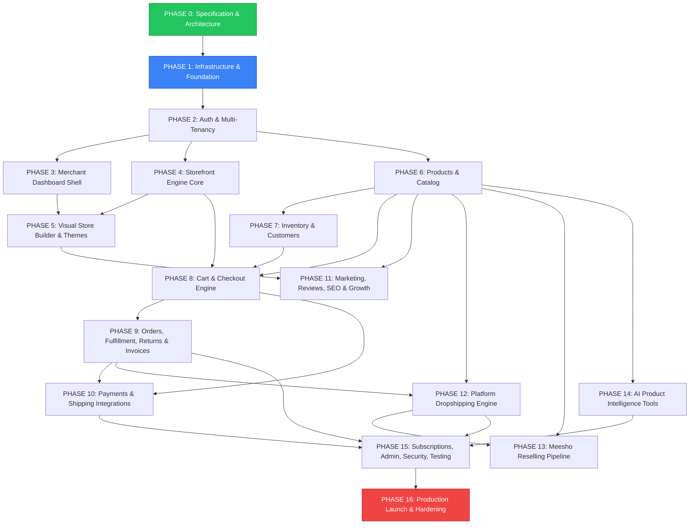

# STOREFY — Development Roadmap & Phase Dependency Graph

**Document Version:** 1.0.0  
**Phase:** 0 — Specification and Architecture  
**Execution Standard:** Section 47 Phase Execution Rule (Spec -> DB -> Backend -> Logic -> Frontend -> Integration -> Testing -> Verification -> Commit)

---

## 1. Complete 16-Phase Dependency Graph

The platform must be constructed strictly according to the architectural dependency order. No phase may commence before its upstream dependencies are implemented, verified, and stabilized.

---

## 2. Phase-by-Phase Execution Roadmap

### PHASE 0: Specification and Architecture (CURRENT)

- **Objective:** Establish unshakeable technical specifications, system boundaries, schemas, and design docs.
- **Deliverables:**
  - `ARCHITECTURE.md` (System topology, DDD boundaries, domain models)
  - `DATABASE-SPECIFICATION.md` (45+ tables, enums, indexes, RLS policies)
  - `API-SPECIFICATION.md` (REST & Server Action contracts across all domains)
  - `BUILDER-SPECIFICATION.md` (Schema AST, 8 element categories, sections, bindings)
  - `SECURITY-SPECIFICATION.md` (Zero-trust rules, RBAC, encryption, threat models)
  - `PLAN-FEATURE-MATRIX.md` (Starter vs Business, 0% fee invariant, quota engine)
  - `DEVELOPMENT-ROADMAP.md` (16-phase dependency graph & criteria)
  - `PROJECT-STRUCTURE.md` (Monorepo directory layout & coding standards)
- **Exit Criteria:** Complete architectural sign-off and approval to proceed to Phase 1.

---

### PHASE 1: Infrastructure and Project Foundation

- **Prerequisites:** Phase 0.
- **Objective:** Scaffold clean Next.js 15 App Router codebase with full TypeScript strictness, styling tokens, and hosted cloud database connectivity.
- **Environment Architecture:** Development operates against hosted cloud infrastructure from the start (Developer PC / Antigravity -> GitHub -> Vercel -> Hosted Supabase PostgreSQL, Auth, and Storage -> Cloudflare). Localhost is NOT the primary development environment or deployment target.
- **Deliverables:**
  - Next.js 15 project initialization with TypeScript (strict mode), Tailwind CSS, and shadcn/ui.
  - Hosted Supabase Development project provisioning and PostgreSQL connection pooling setup via Drizzle ORM (`DATABASE_URL` with PgBouncer/Supavisor, `DIRECT_URL` for migrations).
  - Supabase Auth and Storage client SDK initialization targeting hosted development backend.
  - Environment variable management and runtime validation using Zod (`.env.development`, `.env.staging`, `.env.production`).
  - Global theme base stylesheet (`globals.css`) with CSS custom properties.
  - Vercel deployment pipeline integration with GitHub for automated preview deployments.
  - CI pipeline with linting, formatting (Prettier), and TypeScript compilation checks.
- **Exit Criteria:** `npm run build` succeeds cleanly; database migrations connect and execute against hosted Supabase Development database; Vercel development deployment is live and healthy.

---

### PHASE 2: Authentication and Multi-Tenancy

- **Prerequisites:** Phase 1.
- **Objective:** Implement tenant resolution middleware and user identity/organization membership.
- **Deliverables:**
  - Supabase Auth integration (Sign up, Sign in, Password reset, Session cookies).
  - `organizations`, `stores`, `store_domains`, `staff`, and `roles` database migrations.
  - Next.js Edge Middleware for host-based tenant resolution (`subdomain` and `custom_domain`).
  - Tenant context injection (`x-store-id`, `x-organization-id`) and server helpers.
  - PostgreSQL Row Level Security (RLS) policies enforcing cross-tenant isolation.
  - RBAC module-level permission guards (`requirePermission`).
- **Exit Criteria:** Multi-tenant isolation verified with automated tests; Merchant A cannot query Merchant B records under any circumstances.

---

### PHASE 3: Merchant Dashboard Shell

- **Prerequisites:** Phase 2.
- **Objective:** Deliver the responsive SaaS dashboard layout and organization navigation.
- **Deliverables:**
  - Dashboard app layout (`(dashboard)`) with collapsible sidebar, header, and user menu.
  - Store switcher for multi-store merchants.
  - Top-level metric cards, notification dropdown, and quick-action modals.
  - General Store Settings view (Store name, currency, logo upload, WhatsApp configuration, COD rules).
  - Domain management view (Subdomain setup, custom domain registration, DNS verification UI).
  - Staff invitation and permission management interface.
- **Exit Criteria:** Merchant can create a store, configure settings, invite staff with specific roles, and switch between stores.

---

### PHASE 4: Storefront Engine

- **Prerequisites:** Phase 2.
- **Objective:** Build the public SSR/ISR rendering engine resolving tenant pages from database schemas.
- **Deliverables:**
  - Dynamic storefront routing (`src/app/(storefront)/[domain]/...`).
  - Dynamic layout resolver rendering navigation header and footer from store theme settings.
  - Dynamic theme CSS variable injection based on `store_themes` settings.
  - Baseline pages: Home (`/`), Catalog (`/products`), Collections (`/collections`), About (`/pages/about`), Contact (`/pages/contact`), 404.
  - OpenGraph metadata and SEO tag injection engine.
- **Exit Criteria:** Visiting a store subdomain renders a live, styled, responsive storefront with zero hardcoded merchant data.

---

### PHASE 5: Visual Store Builder and Theme System

- **Prerequisites:** Phase 3, Phase 4.
- **Objective:** Implement the drag-and-drop visual storefront builder with live canvas and theme versioning.
- **Deliverables:**
  - Builder workspace layout: Top toolbar, left element/section drawer, center responsive canvas, right settings panel.
  - Interactive canvas with viewport switching (Desktop, Tablet, Mobile).
  - 8 core element categories (Basic, Media, Layout, Commerce, Marketing, Social, Business).
  - Pre-built section library (Heros, Product Grids, Testimonials, FAQ, Contact).
  - In-memory Undo/Redo history stack (up to 50 actions).
  - Theme revisioning engine: Draft saving, atomic `publish`, and one-click `rollback`.
  - Dynamic data binding evaluator (`{{ Product.title }}`, `{{ Product.price }}`).
- **Exit Criteria:** Merchant can construct custom layouts visually, publish them, and observe instant updates on the live storefront; rollback restores prior version cleanly.

---

### PHASE 6: Products and Catalog

- **Prerequisites:** Phase 2, Phase 3.
- **Objective:** Build the multi-variant catalog engine, category taxonomy, and product management UI.
- **Deliverables:**
  - Database migrations: `products`, `product_variants`, `product_images`, `categories`, `collections`.
  - Product creation and editing forms with variant option matrix (Color, Size, Material).
  - Image upload with drag-and-drop ordering and Supabase Storage integration.
  - Recursive category tree manager and automated/manual collections.
  - Bulk operations: Bulk publish, unpublish, category assignment, CSV import/export.
  - Public storefront product detail page (PDP) and collection listing pages with filtering and sorting.
- **Exit Criteria:** Merchant can manage complex multi-variant products; storefront PDP displays interactive variant selectors with reactive price/inventory updates.

---

### PHASE 7: Inventory and Customers

- **Prerequisites:** Phase 6.
- **Objective:** Implement real-time inventory ledger and customer CRM.
- **Deliverables:**
  - Stock tracking architecture: `on_hand`, `reserved`, `available`, `incoming`.
  - Append-only `inventory_movements` ledger with reason codes.
  - Low-stock automated threshold alerts.
  - Customer profiles with order history, lifetime spend, and address book.
  - Customer segmentation engine (New, Returning, High Value, Inactive).
- **Exit Criteria:** Stock adjustments log immutable audit movements; customer records aggregate spending metrics automatically.

---

### PHASE 8: Cart and Checkout Engine

- **Prerequisites:** Phase 4, Phase 6, Phase 7.
- **Objective:** Deliver the server-authoritative cart and responsive checkout pipeline.
- **Deliverables:**
  - Server-validated cart session API (`/api/v1/storefront/cart`).
  - Atomic stock reservation during checkout initialization (15-minute hold).
  - Zero-trust server-side calculation of subtotals, coupons, taxes, and shipping rates.
  - Responsive one-page checkout flow: Contact -> Address -> Shipping -> Payment -> Review -> Confirmation.
  - Guest checkout and authenticated customer account checkout.
- **Exit Criteria:** Tampered client prices are strictly rejected; simultaneous checkouts on the last remaining stock unit safely prevent overselling.

---

### PHASE 9: Orders, Fulfillment, Returns and Invoices

- **Prerequisites:** Phase 8.
- **Objective:** Implement complete order lifecycle management, tax invoicing, and returns.
- **Deliverables:**
  - Order state machine (`PENDING` through `DELIVERED`, `CANCELLED`, `RTO`).
  - Order fulfillment workflow: Manual and carrier label dispatching.
  - GST-compliant PDF tax invoice generation with unique sequential numbers.
  - Customer return request portal and merchant approval/rejection dashboard.
  - Refund processing with automatic inventory restock options.
- **Exit Criteria:** Orders progress through every lifecycle state; GST invoice PDFs generate accurately with correct tax breakdowns.

---

### PHASE 10: Payments and Shipping Integrations

- **Prerequisites:** Phase 8, Phase 9.
- **Objective:** Integrate external payment gateways and shipping carrier adapters.
- **Deliverables:**
  - `PaymentProvider` interface with Razorpay, Cashfree, and COD adapters.
  - AES-256-GCM encryption vault for merchant payment API keys.
  - Webhook handlers with cryptographic signature verification (`crypto.timingSafeEqual`).
  - `ShippingProvider` interface with Shiprocket and Delhivery adapters.
  - Real-time carrier rate calculation and automated tracking webhook ingestion.
- **Exit Criteria:** Successful end-to-end payment capture with signature verification; webhook failures trigger automatic retries.

---

### PHASE 11: Marketing, Reviews, SEO and Store Growth

- **Prerequisites:** Phase 5, Phase 6.
- **Objective:** Implement promotional coupon engine, customer reviews, and automated SEO.
- **Deliverables:**
  - Advanced coupon engine (Percentage, Flat, BOGO, Free Shipping, Minimum spend, Usage limits).
  - Product reviews with star ratings, buyer verification, and merchant moderation.
  - Click-to-chat WhatsApp order and support button generators.
  - Automated XML sitemaps, robots.txt, OpenGraph tags, and JSON-LD structured microdata.
- **Exit Criteria:** Coupons correctly calculate across all cart permutations; SEO rich snippets validate against Google Rich Results Test.

---

### PHASE 12: Platform Dropshipping Engine

- **Prerequisites:** Phase 6, Phase 9.
- **Objective:** Build internal supplier marketplace and automated order routing.
- **Deliverables:**
  - Platform supplier registration, verification, and supplier dashboard.
  - Supplier wholesale catalog with base costs and suggested retail prices.
  - Reseller one-click product import with custom retail pricing.
  - Automated order routing splitting storefront orders to corresponding suppliers.
  - Neutral shipping label generation masking supplier identity from end customers.
- **Exit Criteria:** Reseller imports dropship item; customer places order; supplier receives fulfillment request with wholesale payout calculation.

---

### PHASE 13: Meesho Reselling Pipeline

- **Prerequisites:** Phase 6, Phase 12.
- **Objective:** Deliver dedicated Meesho product ingestion and manual fulfillment workflow.
- **Deliverables:**
  - Isolated `MeeshoSourceAdapter` parsing product URLs and codes without anti-bot circumvention.
  - Catalog schema normalization mapping Meesho listings to STOREFY product models.
  - Interactive Profit Calculator computing net earnings (Price - Cost - Fees - Ads).
  - Order mirroring and dispatch sheet generator for merchant fulfillment updates.
- **Exit Criteria:** Merchant inputs Meesho URL, previews normalized listing, sets profit margin, imports into catalog, and links tracking upon dispatch.

---

### PHASE 14: AI Product Intelligence Tools

- **Prerequisites:** Phase 6.
- **Objective:** Implement the 7 dedicated AI generation tools with human-in-the-loop validation.
- **Deliverables:**
  - Server-side LLM gateway integrating Google Gemini / Anthropic APIs with prompt grounding.
  - 7 specific tools: Title, Description, SEO Description, Features, Specs, Tags, Category.
  - Human-in-the-loop review modal preventing automatic uninspected publication.
  - Plan quota enforcement (Starter: 50/mo, Business: 500/mo) and token audit logging.
- **Exit Criteria:** All 7 tools generate grounded, high-quality copy; quota limits trigger clean upgrade prompts.

---

### PHASE 15: Subscriptions, Admin, Security, Performance and Testing

- **Prerequisites:** Phase 9, Phase 10, Phase 12, Phase 14.
- **Objective:** Platform SaaS subscription billing, Superadmin portal, security hardening, and test suites.
- **Deliverables:**
  - SaaS subscription billing for Starter (₹199) and Business (₹599) with ₹50 launch month promo.
  - Platform Superadmin dashboard (Tenant audit, User management, Supplier governance, AI analytics).
  - Comprehensive test suite: Unit tests, integration tests, and Playwright E2E checkout test.
  - Security penetration review: RLS verification, CSP headers, rate-limiting stress test.
  - Performance optimization: Lighthouse scores > 90, sub-second TTFB, edge caching.
- **Exit Criteria:** Full end-to-end checkout and merchant signup flow passes all automated tests; security audit shows zero vulnerabilities.

---

### PHASE 16: Production Launch and Hardening

- **Prerequisites:** Phase 15.
- **Objective:** Deploy production environment on Vercel, Supabase, and Cloudflare.
- **Deliverables:**
  - Production DNS, Cloudflare for SaaS custom hostname wildcard setup.
  - Production database provisioning, connection pooling, and automated backup schedules.
  - Sentry error tracking, uptime monitoring, and alert triggers.
  - Operational runbooks and rollback procedures.
- **Exit Criteria:** Platform is live, verified, and accepting live merchant registrations and consumer transactions.
