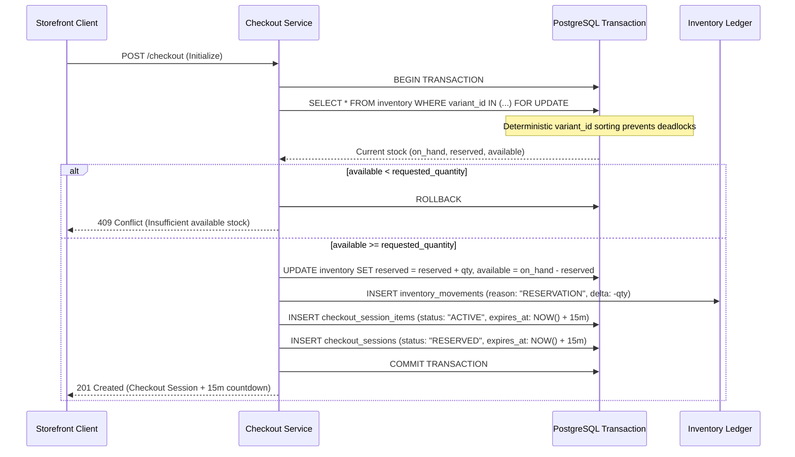

# STOREFY — Phase 8: Cart & Checkout Engine Implementation

## Overview

Phase 8 implements the production-grade **Cart & Checkout Engine** for STOREFY. This phase establishes the critical transactional link between storefront browsing and future order lifecycles:
- **Server-Authoritative Cart**: Cart line items, pricing, inventory availability, discounts, and totals are computed strictly server-side from PostgreSQL database records. Client-provided prices or totals are completely ignored.
- **Guest and Authenticated Cart Management**: Resilient shopping experience supporting anonymous guest visitors with cryptographically opaque session tokens stored in secure HTTP-only cookies (`storefy_cart_token`), with transparent multi-store cart merging on customer authentication.
- **15-Minute Concurrency-Safe Inventory Reservations**: Integrated with Phase 7's inventory ledger. Checkout sessions atomically acquire PostgreSQL row-level locks (`FOR UPDATE`) with deterministic ordering by `variant_id` to prevent deadlocks and prevent overselling.
- **Durable Expiration & Stock Release**: Active stock reservations enforce durable database expiration timestamps (`expires_at`). Automated periodic sweeps and lazy-checks release expired holds back to available stock.
- **6-Step Progressive Checkout Pipeline**: A responsive, accessible single-page checkout flow guiding customers through `CONTACT`, `ADDRESS`, `SHIPPING`, `PAYMENT`, `REVIEW`, and `CONFIRMATION`.
- **Paise Currency Arithmetic**: All monetary fields (item prices, subtotals, shipping charges, taxes, discounts, totals) are stored and computed in integer **Paise** (`BIGINT`), preventing floating-point rounding errors.
- **Multi-Tenant RLS Isolation**: Strict tenant scoping on `store_id` across carts, cart items, checkout sessions, and reservations. Store A shoppers cannot access, mutate, or check out items from Store B.

---

## 1. Cart & Checkout Data Model

### 1.1 Tables (`src/database/schema/cart.ts` & `src/database/schema/checkout.ts`)

#### `carts`
- `id`: UUID (Primary Key)
- `store_id`: UUID (Foreign Key -> `stores.id`, CASCADE)
- `customer_id`: UUID (Foreign Key -> `customers.id`, SET NULL, optional)
- `session_token`: Varchar(128) (Unique guest session token)
- `status`: Varchar(30) (`ACTIVE`, `ABANDONED`, `CONVERTED`, `EXPIRED`, default: `ACTIVE`)
- `currency`: Varchar(3) (Default: `INR`)
- `created_at`: Timestamp with timezone
- `updated_at`: Timestamp with timezone
- **Constraints & Indexes**:
  - Unique Index: `(store_id, session_token)`
  - Index: `(store_id, customer_id)`
  - Index: `(store_id, status)`

#### `cart_items`
- `id`: UUID (Primary Key)
- `cart_id`: UUID (Foreign Key -> `carts.id`, CASCADE)
- `store_id`: UUID (Foreign Key -> `stores.id`, CASCADE)
- `product_id`: UUID (Foreign Key -> `products.id`, CASCADE)
- `variant_id`: UUID (Foreign Key -> `product_variants.id`, CASCADE)
- `quantity`: Integer (Restricted between 1 and 99)
- `price_at_addition`: Bigint (Paise snapshot at time of addition)
- `created_at`: Timestamp with timezone
- `updated_at`: Timestamp with timezone
- **Constraints & Indexes**:
  - Unique Index: `(cart_id, variant_id)`
  - Index: `(store_id, variant_id)`

#### `checkout_sessions`
- `id`: UUID (Primary Key)
- `store_id`: UUID (Foreign Key -> `stores.id`, CASCADE)
- `cart_id`: UUID (Foreign Key -> `carts.id`, SET NULL)
- `customer_id`: UUID (Foreign Key -> `customers.id`, SET NULL)
- `session_token`: Varchar(128) (Matching cart session token)
- `status`: Varchar(30) (`RESERVED`, `COMPLETED`, `EXPIRED`, `CANCELLED`)
- `step`: Varchar(30) (`CONTACT`, `ADDRESS`, `SHIPPING`, `PAYMENT`, `REVIEW`, `CONFIRMATION`)
- `email`: Varchar(255)
- `phone`: Varchar(50)
- `full_name`: Varchar(255)
- `shipping_address`: JSONB (`name`, `phone`, `addressLine1`, `addressLine2`, `city`, `state`, `postalCode`, `country`)
- `billing_address`: JSONB
- `shipping_method_id`: Varchar(50) (`standard`, `express`, `free`)
- `shipping_amount`: Bigint (Paise)
- `subtotal_amount`: Bigint (Paise)
- `discount_amount`: Bigint (Paise)
- `tax_amount`: Bigint (Paise)
- `total_amount`: Bigint (Paise)
- `currency`: Varchar(3) (Default: `INR`)
- `payment_method`: Varchar(50) (`COD`, `ONLINE`)
- `payment_status`: Varchar(50) (`PENDING`, `AUTHORIZED`, `PAID`, `FAILED`)
- `expires_at`: Timestamp with timezone (15-minute TTL from creation)
- `created_at`: Timestamp with timezone
- `updated_at`: Timestamp with timezone
- **Constraints & Indexes**:
  - Unique Index: `(store_id, session_token)`
  - Index: `(store_id, status, expires_at)`

#### `checkout_session_items`
- `id`: UUID (Primary Key)
- `checkout_session_id`: UUID (Foreign Key -> `checkout_sessions.id`, CASCADE)
- `store_id`: UUID (Foreign Key -> `stores.id`, CASCADE)
- `product_id`: UUID (Foreign Key -> `products.id`, CASCADE)
- `variant_id`: UUID (Foreign Key -> `product_variants.id`, CASCADE)
- `quantity`: Integer
- `unit_price`: Bigint (Paise)
- `subtotal`: Bigint (Paise)
- `status`: Varchar(30) (`ACTIVE`, `RELEASED`, `CONSUMED`)
- `expires_at`: Timestamp with timezone
- `created_at`: Timestamp with timezone

---

## 2. Server-Authoritative Architecture & Pricing

### 2.1 The Golden Security Invariant
```
CLIENT DATA IS UNTRUSTED.
SERVER DATA + DATABASE TRANSACTIONS ARE AUTHORITATIVE.
```
- Client sends: `{ variantId: UUID, quantity: number }`.
- Server performs:
  1. Look up variant in `product_variants` table verifying `store_id`.
  2. Read current `price` and `compareAtPrice` in integer Paise.
  3. Validate variant and parent product `status === "ACTIVE"`.
  4. Validate physical stock via Phase 7 `inventory` row (`available >= quantity`).
  5. Compute line subtotal: `quantity * unitPricePaise`.
  6. Compute cart subtotal, shipping tier, tax estimations, and total.

### 2.2 Currency Arithmetic
- Stored exclusively in integer **Paise** (`BIGINT`).
- Zero floating-point math:
  $$\text{₹1,499.00} \longrightarrow 149900 \text{ Paise}$$
- Formatted strictly through `formatPaiseToRupees(paise: number)` using `Intl.NumberFormat("en-IN", { style: "currency", currency: "INR" })`.

---

## 3. Inventory Reservation Engine (`src/modules/checkout/reservation.ts`)

### 3.1 15-Minute Row-Level Lock Reservation


### 3.2 Automated Expiration & Release
- Reservation hold duration: **15 minutes** (`RESERVATION_HOLD_MINUTES = 15`).
- Durable database timestamps: does not depend on ephemeral in-memory Node.js timers.
- Automatic release triggers:
  1. Periodic / on-demand sweep via `releaseExpiredReservations(storeId)`.
  2. Lazy evaluation on `getCheckoutSession`: if `NOW() > session.expiresAt`, immediately releases reserved quantities and marks session `EXPIRED`.
  3. Explicit cancellation: `cancelCheckout` releases active holds and updates status to `CANCELLED`.
  4. Movement audit ledger records `reason: "RELEASE"` with reference type `CHECKOUT_EXPIRATION` or `CHECKOUT_CANCELLATION`.

### 3.3 Phase 9 Order Confirmation Preparation
- `consumeCheckoutReservation(tx, checkoutSessionId, storeId, orderId)` is ready for Phase 9 Order Fulfillment.
- Atomically reduces `on_hand` and `reserved` stock (preserving `available`), marks session items as `CONSUMED`, and records `reason: "FULFILLMENT"` in the immutable ledger.

---

## 4. One-Page 6-Step Checkout Flow

The responsive one-page checkout is organized into 6 progressive stages:

1. **`CONTACT`**:
   - Collects `fullName`, `email`, and `phone`.
   - Validates email syntax and phone formatting (10-15 digits).
   - Prefills authenticated customer details if signed in.
2. **`ADDRESS`**:
   - Collects recipient name, phone, address lines 1 & 2, city, state, postal code, and country.
   - Validates postal code regex (`^[A-Z0-9\s-]+$`).
3. **`SHIPPING`**:
   - Selects delivery option:
     - **Standard Delivery**: ₹99.00 (or ₹0.00 if cart subtotal $\ge$ ₹999.00 threshold).
     - **Express Delivery**: ₹199.00 (1-2 business days).
   - Recalculates total and shipping breakdown dynamically on the server.
4. **`PAYMENT`**:
   - Honest payment preparation architecture:
     - **Cash on Delivery (COD)**: Validates store settings (`isCodEnabled`, max threshold).
     - **Online Payment**: Prepares intent for Phase 10 payment gateways (Razorpay/Cashfree).
5. **`REVIEW`**:
   - Comprehensive order summary displaying items, quantities, unit prices, shipping method, address, contact, and total in INR.
   - All numbers rendered directly from server-validated session DTO.
6. **`CONFIRMATION`**:
   - Transitions session to `CONFIRMATION` state, clears cart items, and prepares order handoff token for Phase 9 Order Engine.

---

## 5. Storefront UI Components

| Component | File Path | Responsibilities |
| :--- | :--- | :--- |
| **`CartProvider`** | `src/components/storefront/cart-context.tsx` | Client context for global cart state, drawer toggle, and real-time operations. |
| **`CartDrawer`** | `src/components/storefront/cart-drawer.tsx` | Slide-out sheet with quantity controls, line item remove, and free shipping progress. |
| **`CartPage`** | `src/app/(storefront)/[domain]/cart/page.tsx` | Server component rendering dedicated full-page cart. |
| **`CheckoutFlow`** | `src/components/storefront/checkout-flow.tsx` | 6-step progress stepper, 15-minute countdown banner, forms, and order review sidebar. |
| **`CheckoutPage`** | `src/app/(storefront)/[domain]/checkout/page.tsx` | Server component resolving tenant, initiating reservation hold, and rendering flow. |

---

## 6. REST API Endpoints

### 6.1 Cart API (`/api/v1/storefront/cart`)
- `GET /api/v1/storefront/cart`: Resolves authoritative cart and pricing.
- `POST /api/v1/storefront/cart`: Adds an item (`variantId`, `quantity`).
- `PATCH /api/v1/storefront/cart`: Updates item quantity (1–99).
- `DELETE /api/v1/storefront/cart?variantId=...`: Removes a specific item or clears entire cart.

### 6.2 Checkout API (`/api/v1/storefront/checkout`)
- `GET /api/v1/storefront/checkout?checkoutId=...`: Loads checkout session and validates TTL.
- `POST /api/v1/storefront/checkout`: Initializes checkout session and reserves stock.
- `PATCH /api/v1/storefront/checkout`: Updates steps (`contact`, `address`, `shipping`, `payment`, `confirm`).
- `DELETE /api/v1/storefront/checkout?checkoutId=...`: Cancels checkout and releases reserved stock.

---

## 7. Security, Concurrency & Tenant Isolation Tests

All 33 test suites (250 tests) pass with 0 errors:

1. **Price Tampering Protection (`tests/unit/cart-checkout-security.test.ts`)**:
   - Strips client-claimed prices, negative prices, and forged subtotal amounts.
   - Confirms server computes strictly from catalog integer Paise.
2. **Overselling & Concurrency (`tests/unit/cart-checkout-security.test.ts`)**:
   - Stock = 1: First request reserves, second simultaneous request is rejected with `ConflictError`.
   - Invariant `available = on_hand - reserved` strictly maintained.
3. **Reservation Expiration (`tests/unit/cart-checkout-security.test.ts`)**:
   - Past 15 minutes, reserved stock is released and available stock restored.
4. **Cross-Store Multi-Tenant Isolation (`tests/unit/cart-checkout-cross-tenant.test.ts`)**:
   - Store B cannot read, mutate, or check out items from Store A's cart or session.
   - Forged variant IDs from other stores are strictly rejected.
5. **Customer Privacy (`tests/unit/cart-checkout-security.test.ts`)**:
   - Internal merchant costs, wholesale margins, and private supplier IDs are sanitized from DTOs.
